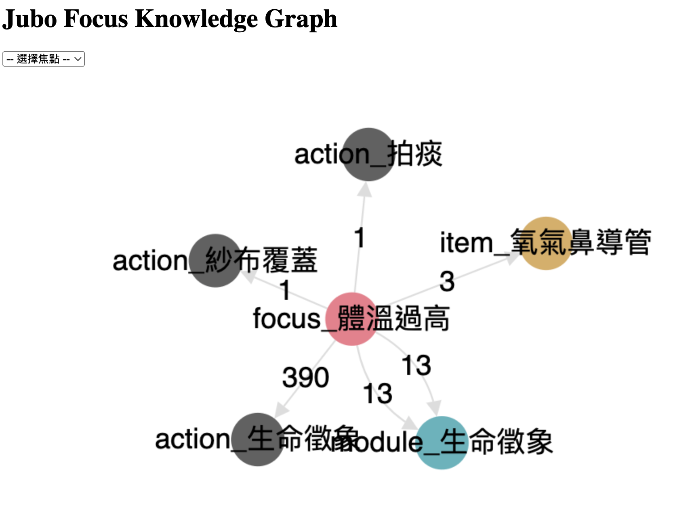

# Focus Knowledge Graph

## Visualization
* Usage : click a focus, then the interface will query related node to display their relationships
* Interface : [Web](https://focus-knowledge-graph-ge6dae6qzq-de.a.run.app)
* Node 
    * Focus (red)
    * Module (green)
    * Action (gray)
    * Item (orange)
* Edge
    * count
* Example
    