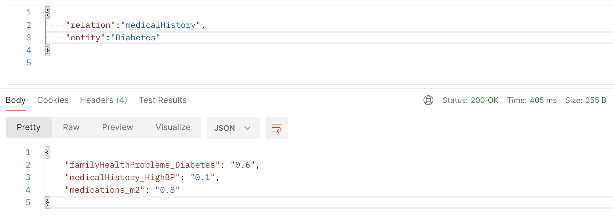
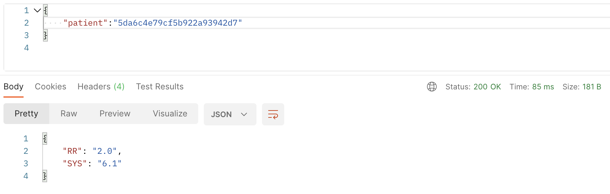
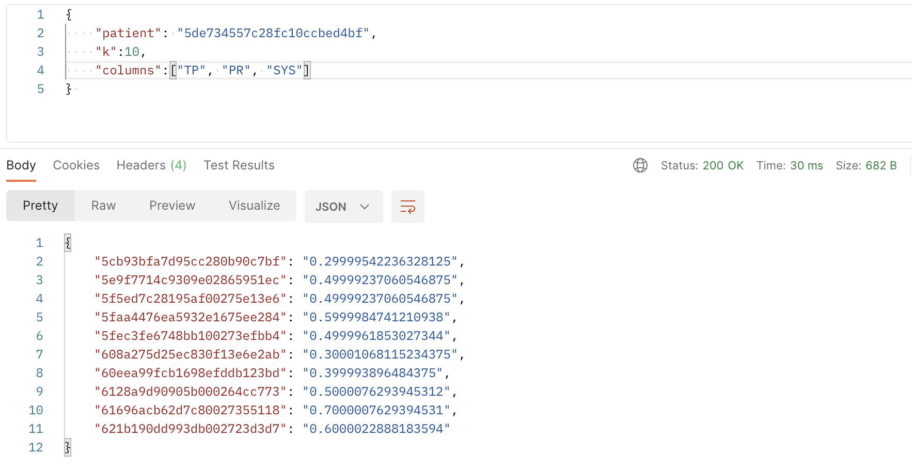
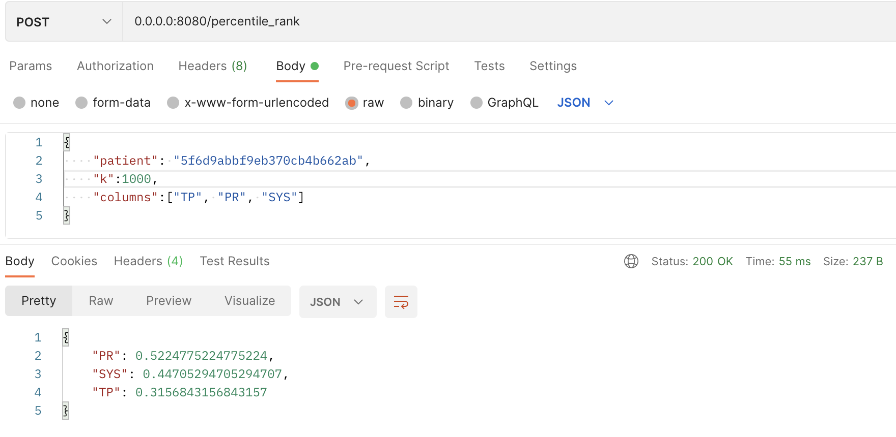
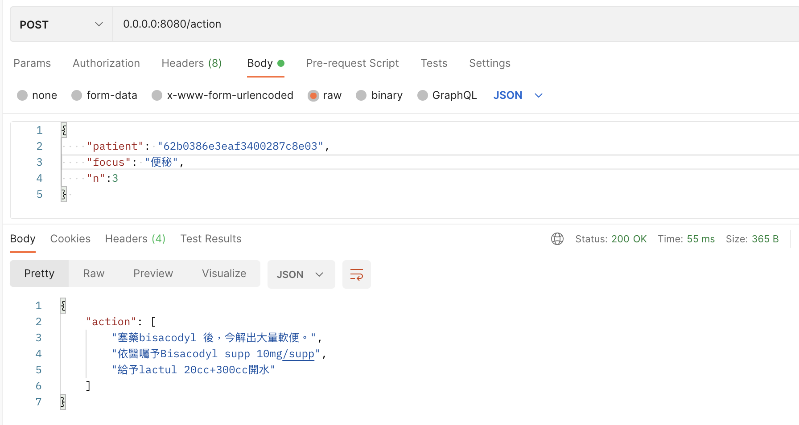
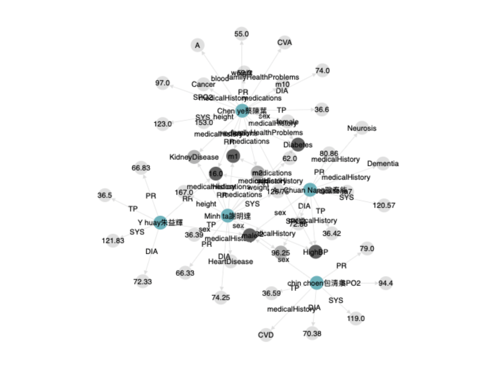

# Patient Knowledge Graph

## TL;DR
* In this repo, we constructed a pipeline to collect data in Jubo then tranform them as the patient knowledge graph.
* The patient knowledge graph could be used for different tasks and visualization.

## Pipeline
#### DataHub 
* Target : load data from mongo to BQ
* Flow : mongo -> CloudSQL -> BQ(raw) -> SQL -> BQ(metadata)

#### Update
* Target : a DAG to update (initialize) the patient KG daily
* Flow : bq(metadata) -> python scripts -> store triples to bq (application data) -> trigger the serving api to restart (update the triples)

#### Serving
* Target : an api where user could query the KG
* Flow : scripts -> flask api (define input/output) -> dockerfile -> deployments

## Disease Features
* Input 
    * relation (e.g. family health problem)
    * entity (e.g. a disease)
* Output 
    * features (Compare non-disease patients, finding features often occured in the combination of the relation and the entity)
        * numerical : value range on the common feature
        * categorical : probability for having the common feature
* Usage
    * API : https://patient-knowledge-graph-ge6dae6qzq-de.a.run.app/query
    * send a request conating "entity" and "relation" key to get the output

        ```{"entity": entity, "relation": relation}```
    * Example
        

## Patient Feature Analysis
* Input 
    * patient
* Output 
    * abnormal features (compared to other patients)
        * numerical : value range on the common feature
        * categorical : probability for having the common feature
* Usage
    * API : https://patient-knowledge-graph-ge6dae6qzq-de.a.run.app/anyalyse
    * send a request conating "entity" and "relation" key to get the output
        ```{"patient": patient}```
    * Example
        

## Similar Patients
* Input 
    * patient
    * (optional) k
        * number of patients for output
        * In default, k is 10
    * (optional) columns
        * selected columns for finding neighbors
        * In default, all columns will be runned
* Output 
    * similar patients 
    * similarity
        * For numerical columns, manhattan distance was applied
        * Used Jaccard distance for categorical columns
* Usage
    * API : https://patient-knowledge-graph-ge6dae6qzq-de.a.run.app/neighbors
    * send a request conating "entity" and "relation" key to get the output

        ```{"patient": patientId}```
    * Example
        

## Percentile Rank
* Input 
    * patient
    * (optional) k
        * number of top-similar patients to calculate PR
        * In default, k is 1000
    * (optional) columns
        * numerical columns for calculating PR
        * In default, all numerical columns will be runned
* Output 
    * column
    * PR
* Usage
    * API : https://patient-knowledge-graph-ge6dae6qzq-de.a.run.app/percentila_rank
    * send a request conating "patient" and "columns" key to get the output

        ```{"patient": patientId, "columns": [col1, col2, ...]}```
    * Example
        

## Recommend Action
* Input 
    * patient
    * focus
    * (optional) n
        * number of recommended action
        * In default, n is 3
* Output 
    * action
* Usage
    * API : https://patient-knowledge-graph-ge6dae6qzq-de.a.run.app/action
    * send a request conating "patient" and "focus" key to get the output

        ```{"patient": patientId, "focus": focus}```
    * Example
        

## Visualization
* Usage : click a disease, then the interface will query patients to display their relationships
* Interface : [Web](https://patient-knowledge-graph-ge6dae6qzq-de.a.run.app)
* Node 
    * Patient (green)
    * entity (gray)
* Edge
    * relation between patient and entity 
* Note : only displays 5 patients now
* Example
    